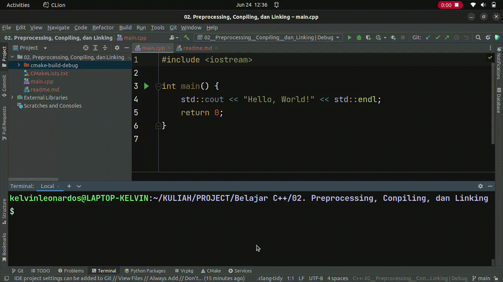

# Preprocessing, Conpiling, dan Linking

## 1. Preprocessing
`#include`: preprocessing directive, yang akan mengambil / mengcopy file dari tempat lain. dan digabungkan ke source code. Contohnya adalah `iostream`.
> Akan berguna saat bekerja dengan external files.

Untuk membuat file preprocessing, dapat menggunakan syntax berikut di console:
```angular2html
g++ -E nama_file_cpp > nama_file_preprocessing 
```
\
`#include` juga berfungsi untuk menambahkan baris kode dari file lain, karena sifatnya yang cukup mirip dengan copy. `#include` juga dapat ditambahkan bukan hanya di barid pertama.

## 2. Conpiling
File hasil preprocessing kemudian dicompile menjadi `obj file` (bahasa mesin).
Untuk mengcompile file cpp menjadi `file obj`, menggunakan:
```angular2html
g++ -c nama_file
```
Untuk dapat melihat isi `file obj` menggunakan:
```angular2html
objdump -d nama_file_obj
```


> Proses compile akan berjalan kalau tidak ada eror.

## 3. Linking
Beberapa `file obj` akan disatukan dan dijadikan file `.exe`.
Untuk dapat melakukan linking, dapat menggunakan:
```angular2html
g++ nama_file_cpp
```
atau:
```angular2html
g++ nama_file_obj
```
Selain itu, karena linking dapat menghubungkan lebih dari satu file, maka dapat menggunakan:
```angular2html
g++ nama_file_cpp_1 nama_file_cpp_2
```
begiru juga dengan `file obj`nya.